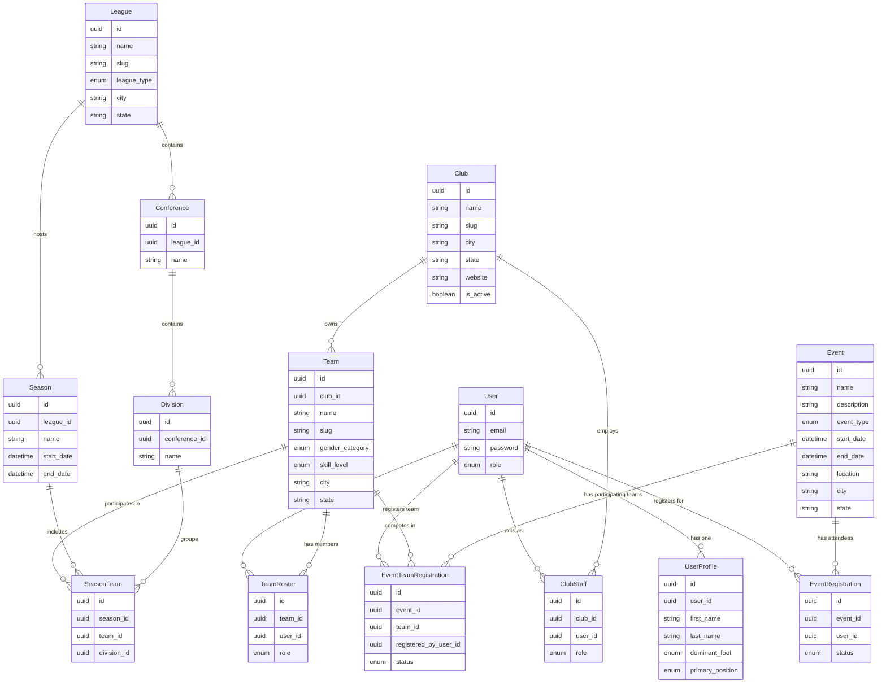

# Architecture & Data Model

This document provides a high-level overview of the data models and relationships in the Onside platform.

## Entity Relationship Diagram

---

## Class Diagram (Backend)

```mermaid
classDiagram

    %% ── Enums ────────────────────────────────────────────────────────────────
    class UserRole {
        <<enumeration>>
        BASIC_USER
        COACH
        TEAM_MANAGER
        LEAGUE_ADMIN
        SUPER_ADMIN
    }

    class AuthProvider {
        <<enumeration>>
        LOCAL
        GOOGLE
        GITHUB
    }

    class GenderCategory {
        <<enumeration>>
        MALE
        FEMALE
        COED
        OPEN
    }

    class SkillLevel {
        <<enumeration>>
        RECREATIONAL
        INTERMEDIATE
        COMPETITIVE
        ELITE
        SEMI_PRO
        PROFESSIONAL
    }

    class LeagueType {
        <<enumeration>>
        RECREATIONAL
        COMPETITIVE
        TOURNAMENT
    }

    class EventType {
        <<enumeration>>
        GAME
        TRYOUT
        TOURNAMENT
        ID_CAMP
        COMBINE
        PICKUP
        OTHER
    }

    class RegistrationStatus {
        <<enumeration>>
        PENDING
        CONFIRMED
        WAITLISTED
        CANCELLED
    }

    class PaymentStatus {
        <<enumeration>>
        NOT_REQUIRED
        PENDING
        COMPLETED
        FAILED
    }

    class PlayerPosition {
        <<enumeration>>
        GOALKEEPER
        DEFENDER
        MIDFIELDER
        FORWARD
    }

    class ClubStaffRole {
        <<enumeration>>
        OWNER
        ADMIN
        MEMBER
    }

    class TeamRosterRole {
        <<enumeration>>
        PLAYER
        COACH
    }

    %% ── Entities ─────────────────────────────────────────────────────────────
    class User {
        +UUID id
        +String email
        +String passwordHash
        +AuthProvider authProvider
        +Boolean isActive
        +Boolean isEmailVerified
        +LocalDateTime lastLoginAt
        +LocalDateTime createdAt
        +LocalDateTime updatedAt
        +LocalDateTime deletedAt
        -UserProfile profile
        -List~UserRoleEntity~ roles
        -List~RefreshToken~ refreshTokens
    }

    class UserProfile {
        +UUID id
        +UUID userId
        +String firstName
        +String lastName
        +LocalDate dateOfBirth
        +String phone
        +String avatarUrl
        +String bio
        +PlayerPosition primaryPosition
        +PlayerPosition secondaryPosition
        +SkillLevel skillLevel
        +String city
        +String state
        +Boolean profileIsPublic
    }

    class UserRoleEntity {
        +UUID id
        +UUID userId
        +UserRole role
        +String contextType
        +UUID contextId
        +LocalDateTime grantedAt
        +LocalDateTime revokedAt
    }

    class RefreshToken {
        +UUID id
        +UUID userId
        +String tokenHash
        +String deviceInfo
        +LocalDateTime expiresAt
        +LocalDateTime revokedAt
        +isExpired() Boolean
        +isRevoked() Boolean
        +isValid() Boolean
        +revoke() void
    }

    class EmailVerificationToken {
        +UUID id
        +UUID userId
        +String tokenHash
        +LocalDateTime expiresAt
        +LocalDateTime usedAt
        +isExpired() Boolean
        +isUsed() Boolean
        +isValid() Boolean
        +markUsed() void
    }

    class PasswordResetToken {
        +UUID id
        +UUID userId
        +String tokenHash
        +LocalDateTime expiresAt
        +LocalDateTime usedAt
        +isExpired() Boolean
        +isUsed() Boolean
        +markUsed() void
    }

    class Club {
        +UUID id
        +String name
        +String shortName
        +String slug
        +String description
        +String city
        +String state
        +Integer foundedYear
        +String website
        +String logoUrl
        +Boolean isActive
        +Boolean isVerified
        +LocalDateTime deletedAt
        -List~Team~ teams
        -List~ClubStaff~ staff
    }

    class ClubStaff {
        +UUID id
        +UUID clubId
        +UUID userId
        +ClubStaffRole role
        +Boolean isActive
        +LocalDateTime revokedAt
        +isRevoked() Boolean
        +revoke() void
    }

    class Team {
        +UUID id
        +UUID clubId
        +String name
        +String shortName
        +String slug
        +GenderCategory genderCategory
        +SkillLevel skillLevel
        +LeagueType leagueType
        +String city
        +String state
        +Boolean isActive
        +Boolean isRecruiting
        +LocalDateTime deletedAt
        -List~TeamRoster~ roster
        -List~SeasonTeam~ seasonTeams
    }

    class TeamRoster {
        +UUID id
        +UUID teamId
        +UUID userId
        +TeamRosterRole role
        +Integer jerseyNumber
        +LocalDate joinedAt
        +LocalDate leftAt
        +Boolean isActive
        +PlayerPosition position
        +isCurrentMember() Boolean
        +leave() void
    }

    class League {
        +UUID id
        +String name
        +String shortName
        +String slug
        +GenderCategory genderCategory
        +SkillLevel skillLevel
        +LeagueType leagueType
        +String description
        +Integer foundedYear
        +String website
        +String logoUrl
        +Boolean isActive
        -List~Conference~ conferences
        -List~Season~ seasons
    }

    class Conference {
        +UUID id
        +UUID leagueId
        +String name
        +String shortName
        +String slug
        +String region
        +Boolean isActive
        -List~Division~ divisions
    }

    class Division {
        +UUID id
        +UUID conferenceId
        +String name
        +String shortName
        +String slug
        +Boolean isActive
    }

    class Season {
        +UUID id
        +UUID leagueId
        +String name
        +Short year
        +LocalDate startDate
        +LocalDate endDate
        +Boolean isActive
        +Boolean isCurrent
        -List~SeasonTeam~ seasonTeams
    }

    class SeasonTeam {
        +UUID id
        +UUID seasonId
        +UUID teamId
        +UUID conferenceId
        +UUID divisionId
        +Boolean isActive
    }

    class Event {
        +UUID id
        +String name
        +String slug
        +EventType type
        +String description
        +GenderCategory genderCategory
        +SkillLevel skillLevel
        +UUID hostClubId
        +UUID hostUserId
        +UUID leagueId
        +String city
        +String state
        +LocalDate startDate
        +LocalDate endDate
        +Integer capacity
        +Boolean waitlistEnabled
        +BigDecimal individualFee
        +Boolean isPublished
        +Boolean isCancelled
        +LocalDateTime deletedAt
        -List~EventRegistration~ registrations
        -List~EventTeamRegistration~ teamRegistrations
    }

    class EventRegistration {
        +UUID id
        +UUID userId
        +UUID eventId
        +RegistrationStatus status
        +PaymentStatus paymentStatus
        +LocalDateTime registeredAt
        +Integer waitlistPosition
    }

    class EventTeamRegistration {
        +UUID id
        +UUID eventId
        +UUID teamId
        +UUID registeredBy
        +RegistrationStatus status
        +PaymentStatus paymentStatus
        +LocalDateTime registeredAt
    }

    %% ── Services ─────────────────────────────────────────────────────────────
    class AuthService {
        <<Service>>
        +register(RegisterRequest) AuthResponse
        +login(LoginRequest) AuthResponse
        +refresh(RefreshTokenRequest) AuthResponse
        +logout(RefreshTokenRequest) void
        +logoutAll(UUID userId) void
    }

    class JwtService {
        <<Service>>
        +generateAccessToken(UUID, String, List) String
        +validateAndExtractClaims(String) Claims
        +extractUserId(String) UUID
        +extractEmail(String) String
        +extractRoles(String) List
        +isTokenValid(String) Boolean
    }

    class UserDetailsServiceImpl {
        <<Service>>
        +loadUserByUsername(String) UserDetails
        +loadUserEntityByEmail(String) User
        +buildUserDetails(User) UserDetails
    }

    class UserService {
        <<Service>>
        +getMe(UUID) UserResponseDto
        +updateMe(UUID, UserUpdateDto) UserResponseDto
    }

    class ClubService {
        <<Service>>
        +getAllClubs(String) List
        +getClubBySlug(String) ClubResponseDto
        +searchClubs(String) List
        +getMyClubs(UUID) List
        +createClub(ClubRequestDto, UUID) ClubResponseDto
        +updateClub(String, ClubRequestDto, UUID) ClubResponseDto
        +deactivateClub(String, UUID) void
        +addStaff(String, AddStaffRequestDto, UUID) void
        +removeStaff(String, UUID, UUID) void
    }

    class TeamService {
        <<Service>>
        +getTeamsByClub(String) List
        +getTeam(String, String) TeamResponseDto
        +browseTeams(GenderCategory, SkillLevel, String, Boolean) List
        +getTeamsByLeague(String) List
        +searchTeams(String, GenderCategory) List
        +getActiveRoster(String, String) List
        +createTeam(String, TeamRequestDto, UUID) TeamResponseDto
        +updateTeam(String, String, TeamRequestDto, UUID) TeamResponseDto
        +deactivateTeam(String, String, UUID) void
        +addRosterMember(String, String, RosterRequestDto, UUID) void
        +removeRosterMember(String, String, UUID, UUID) void
    }

    class LeagueService {
        <<Service>>
        +getMyLeagues(UUID) List
        +getAllLeagues(GenderCategory, SkillLevel, LeagueType) List
        +getLeagueBySlug(String) LeagueResponseDto
        +searchLeagues(String) List
        +createLeague(LeagueRequestDto, UUID) LeagueResponseDto
        +updateLeague(String, LeagueRequestDto, UUID) LeagueResponseDto
        +deactivateLeague(String, UUID) void
    }

    class EventService {
        <<Service>>
        +create(EventRequest, UUID) EventResponse
        +getPublished() List
        +getBySlug(String) EventResponse
        +search(EventType, String, GenderCategory, LocalDate) List
        +update(String, EventRequest) EventResponse
        +publish(String) EventResponse
        +cancel(String, String) EventResponse
        +delete(String) void
        +register(String, UUID, EventRegistrationRequest) EventRegistrationResponse
        +cancelRegistration(String, UUID) void
        +getMyRegistrations(UUID) List
        +getEventRegistrations(String) List
    }

    %% ── Repositories ─────────────────────────────────────────────────────────
    class UserRepository {
        <<Repository>>
        +findByEmailIgnoreCase(String) Optional~User~
        +existsByEmail(String) Boolean
    }

    class ClubRepository {
        <<Repository>>
        +findBySlug(String) Optional~Club~
        +existsBySlug(String) Boolean
        +searchByName(String) List~Club~
        +findByStaffUserId(UUID) List~Club~
    }

    class TeamRepository {
        <<Repository>>
        +findByClubSlugAndSlug(String, String) Optional~Team~
        +findByClubSlug(String) List~Team~
        +searchTeams(String, GenderCategory) List~Team~
        +browseTeams(GenderCategory, SkillLevel, String, Boolean) List~Team~
    }

    class LeagueRepository {
        <<Repository>>
        +findBySlug(String) Optional~League~
        +findLeaguesByUserId(UUID) List~League~
        +searchByName(String) List~League~
    }

    class EventRepository {
        <<Repository>>
        +findBySlug(String) Optional~Event~
        +findPublishedEvents() List~Event~
        +searchEvents(EventType, String, GenderCategory, LocalDate) List~Event~
    }

    %% ── Controllers ──────────────────────────────────────────────────────────
    class AuthController {
        <<RestController>>
        +register(RegisterRequest) ResponseEntity
        +login(LoginRequest) ResponseEntity
        +refresh(RefreshTokenRequest) ResponseEntity
        +logout(RefreshTokenRequest) ResponseEntity
        +logoutAll(User) ResponseEntity
    }

    class UserController {
        <<RestController>>
        +getMe(User) ResponseEntity
        +updateMe(User, UserUpdateDto) ResponseEntity
    }

    class ClubController {
        <<RestController>>
        +getAll(String) ResponseEntity
        +search(String) ResponseEntity
        +getMine(User) ResponseEntity
        +getBySlug(String) ResponseEntity
        +getStaff(String) ResponseEntity
        +create(User, ClubRequestDto) ResponseEntity
        +update(String, User, ClubRequestDto) ResponseEntity
        +deactivate(String, User) ResponseEntity
        +addStaff(String, User, AddStaffRequestDto) ResponseEntity
        +removeStaff(String, UUID, User) ResponseEntity
    }

    class TeamController {
        <<RestController>>
        +getByClub(String) ResponseEntity
        +getOne(String, String) ResponseEntity
        +getRoster(String, String) ResponseEntity
        +browse(GenderCategory, SkillLevel, String, Boolean) ResponseEntity
        +search(String, GenderCategory) ResponseEntity
        +create(String, User, TeamRequestDto) ResponseEntity
        +update(String, String, User, TeamRequestDto) ResponseEntity
        +deactivate(String, String, User) ResponseEntity
        +addRosterMember(String, String, User, RosterRequestDto) ResponseEntity
        +removeRosterMember(String, String, UUID, User) ResponseEntity
    }

    class LeagueController {
        <<RestController>>
        +getMine(User) ResponseEntity
        +getAll(GenderCategory, SkillLevel, LeagueType) ResponseEntity
        +search(String) ResponseEntity
        +getBySlug(String) ResponseEntity
        +getTeams(String) ResponseEntity
        +create(User, LeagueRequestDto) ResponseEntity
        +update(String, User, LeagueRequestDto) ResponseEntity
        +deactivate(String, User) ResponseEntity
    }

    class EventController {
        <<RestController>>
        +getPublished() ResponseEntity
        +search(EventType, String, GenderCategory, LocalDate) ResponseEntity
        +getBySlug(String) ResponseEntity
        +create(User, EventRequest) ResponseEntity
        +update(String, EventRequest) ResponseEntity
        +publish(String) ResponseEntity
        +cancel(String, String) ResponseEntity
        +delete(String) ResponseEntity
        +register(String, User, EventRegistrationRequest) ResponseEntity
        +cancelRegistration(String, User) ResponseEntity
        +getMyRegistrations(User) ResponseEntity
        +getEventRegistrations(String) ResponseEntity
    }

    %% ── Security ─────────────────────────────────────────────────────────────
    class JwtAuthFilter {
        <<Filter>>
        -JwtService jwtService
        -UserDetailsServiceImpl userDetailsService
        +doFilterInternal(request, response, chain) void
    }

    %% ── Relationships ────────────────────────────────────────────────────────
    User "1" --> "1" UserProfile : has
    User "1" --> "*" UserRoleEntity : has
    User "1" --> "*" RefreshToken : has
    User "1" --> "*" EmailVerificationToken : has
    User "1" --> "*" PasswordResetToken : has

    Club "1" --> "*" Team : owns
    Club "1" --> "*" ClubStaff : employs

    Team "1" --> "*" TeamRoster : has
    Team "1" --> "*" SeasonTeam : participates in

    League "1" --> "*" Conference : contains
    League "1" --> "*" Season : hosts

    Conference "1" --> "*" Division : contains

    Season "1" --> "*" SeasonTeam : includes

    Event "1" --> "*" EventRegistration : has
    Event "1" --> "*" EventTeamRegistration : has

    AuthController ..> AuthService : uses
    UserController ..> UserService : uses
    ClubController ..> ClubService : uses
    TeamController ..> TeamService : uses
    LeagueController ..> LeagueService : uses
    EventController ..> EventService : uses

    AuthService ..> UserRepository : uses
    AuthService ..> JwtService : uses
    UserService ..> UserRepository : uses
    ClubService ..> ClubRepository : uses
    TeamService ..> TeamRepository : uses
    TeamService ..> ClubRepository : uses
    LeagueService ..> LeagueRepository : uses
    EventService ..> EventRepository : uses

    JwtAuthFilter ..> JwtService : uses
    JwtAuthFilter ..> UserDetailsServiceImpl : uses
    UserDetailsServiceImpl ..> UserRepository : uses
```

---

## Component Diagram

```mermaid
graph TB
    subgraph Browser["Browser"]
        subgraph Frontend["React Frontend (Vite)"]
            subgraph EntryPoint["Entry Point"]
                Main["main.jsx\nBrowserRouter"]
                App["App.jsx\nRouter / Route Guards"]
            end

            subgraph Contexts["Global State (Context API)"]
                AuthCtx["AuthContext\nuser, isAuthenticated,\nlogin, logout, register"]
                ModalCtx["AuthModalContext\nmodalOpen, modalType,\nopenLogin, openRegister"]
            end

            subgraph Guards["Route Guards"]
                ProtectedRoute["ProtectedRoute\n(requires auth)"]
                PublicRoute["PublicRoute\n(redirects if logged in)"]
            end

            subgraph Pages["Pages"]
                Landing["Landing\nHero + Marketing Sections"]
                Browse["BrowsePage\nDiscover Leagues/Teams/Events"]
                Dashboard["Dashboard\nOverview · Leagues · Teams · Profile"]
                AdminDash["AdminDashboard\nClub · Teams · Events · Seasons · Staff"]
                EventDetail["EventDetailPage\nDetails + Registration UI"]
                LeagueDetail["LeagueDetailPage\nLeague Info + Team List"]
                TeamDetail["TeamDetailPage\nTeam Info + Roster"]
                CreateEvent["CreateEventPage\nEvent Form"]
                CreateClub["CreateClubPage\nClub Form"]
                LeagueReq["LeagueRequestPage"]
            end

            subgraph BrowseTabs["Browse Tabs"]
                BLeagues["BrowseLeagues"]
                BTeams["BrowseTeams"]
                BCollege["BrowseCollege"]
                BHighSchool["BrowseHighSchool"]
                BYouth["BrowseYouth"]
                BIndoor["BrowseIndoor"]
            end

            subgraph DashSections["Dashboard Sections"]
                OverviewSec["OverviewSection"]
                MyLeagues["MyLeaguesSection"]
                MyTeams["MyTeamsSection"]
                MyProfile["MyProfileSection"]
            end

            subgraph AdminSections["Admin Sections"]
                AdminOverview["AdminOverviewSection"]
                ManageClub["ManageClubSection"]
                ManageTeams["ManageTeamsSection"]
                ManageEvents["ManageEventsSection"]
                ManageSeasons["ManageSeasonsSection"]
                ManageStaff["ManageStaffSection"]
                EventRegs["EventRegistrationsSection"]
            end

            subgraph AuthComponents["Auth Components"]
                AuthModal["AuthModal"]
                LoginForm["LoginForm"]
                RegisterForm["RegisterForm"]
            end

            subgraph Layout["Layout Components"]
                LandingNav["LandingNav"]
                LandingFooter["LandingFooter"]
                DashSidebar["DashboardSidebar"]
                AdminSidebar["AdminSidebar"]
            end

            subgraph APILayer["API Layer"]
                AxiosClient["axiosClient\nJWT interceptor\ntoken storage"]
                AuthAPI["authApi\nlogin · register\nrefresh · logout"]
            end
        end
    end

    subgraph BackendServer["Spring Boot Backend"]
        subgraph SecurityLayer["Security Layer"]
            SecConfig["SecurityConfig\nCORS · JWT · RBAC"]
            JwtFilter["JwtAuthFilter\nBearer token extraction\n+ SecurityContext"]
            JwtSvc["JwtService\nRS256 sign/validate"]
        end

        subgraph Controllers["REST Controllers"]
            AuthCtrl["AuthController\n/auth"]
            UserCtrl["UserController\n/users"]
            ClubCtrl["ClubController\n/clubs"]
            TeamCtrl["TeamController\n/teams\n/clubs/:slug/teams"]
            LeagueCtrl["LeagueController\n/leagues"]
            EventCtrl["EventController\n/events"]
        end

        subgraph Services["Service Layer"]
            AuthSvc["AuthService"]
            UserSvc["UserService"]
            ClubSvc["ClubService"]
            TeamSvc["TeamService"]
            LeagueSvc["LeagueService"]
            EventSvc["EventService"]
        end

        subgraph Repositories["Repository Layer (Spring Data JPA)"]
            UserRepo["UserRepository"]
            ClubRepo["ClubRepository"]
            TeamRepo["TeamRepository"]
            LeagueRepo["LeagueRepository"]
            EventRepo["EventRepository"]
            TokenRepo["RefreshTokenRepository"]
        end

        subgraph DB["PostgreSQL Database"]
            UserTbl[("users\nuser_profiles\nuser_roles\nrefresh_tokens")]
            ClubTbl[("clubs\nclub_staff\nteams\nteam_roster")]
            LeagueTbl[("leagues\nconferences\ndivisions\nseasons\nseason_teams")]
            EventTbl[("events\nevent_registrations\nevent_team_registrations")]
        end
    end

    %% Entry Point wiring
    Main --> App
    Main --> AuthCtx
    Main --> ModalCtx

    %% App routing
    App --> ProtectedRoute
    App --> PublicRoute
    App --> Landing
    App --> Browse
    App --> Dashboard
    App --> AdminDash
    App --> EventDetail
    App --> LeagueDetail
    App --> TeamDetail
    App --> CreateEvent
    App --> CreateClub

    %% Auth flow
    AuthCtx --> AuthAPI
    AuthAPI --> AxiosClient
    ModalCtx --> AuthModal
    AuthModal --> LoginForm
    AuthModal --> RegisterForm
    LoginForm --> AuthCtx
    RegisterForm --> AuthCtx

    %% Pages using context
    Dashboard --> AuthCtx
    AdminDash --> AuthCtx
    EventDetail --> AuthCtx
    ModalCtx --> EventDetail

    %% Page → Section composition
    Browse --> BLeagues
    Browse --> BTeams
    Browse --> BCollege
    Browse --> BHighSchool
    Browse --> BYouth
    Browse --> BIndoor
    Dashboard --> OverviewSec
    Dashboard --> MyLeagues
    Dashboard --> MyTeams
    Dashboard --> MyProfile
    Dashboard --> DashSidebar
    AdminDash --> AdminOverview
    AdminDash --> ManageClub
    AdminDash --> ManageTeams
    AdminDash --> ManageEvents
    AdminDash --> ManageSeasons
    AdminDash --> ManageStaff
    AdminDash --> EventRegs
    AdminDash --> AdminSidebar
    Landing --> LandingNav
    Landing --> LandingFooter

    %% API calls (HTTP REST)
    AxiosClient -- "POST /auth/**" --> AuthCtrl
    AxiosClient -- "GET/PUT /users/me" --> UserCtrl
    AxiosClient -- "GET/POST/PUT/DELETE /clubs/**" --> ClubCtrl
    AxiosClient -- "GET/POST/PUT/DELETE /teams/**" --> TeamCtrl
    AxiosClient -- "GET/POST/PUT/DELETE /leagues/**" --> LeagueCtrl
    AxiosClient -- "GET/POST/PUT/DELETE /events/**" --> EventCtrl

    %% Security filter chain
    SecConfig --> JwtFilter
    JwtFilter --> JwtSvc
    JwtFilter --> Controllers

    %% Controller → Service
    AuthCtrl --> AuthSvc
    UserCtrl --> UserSvc
    ClubCtrl --> ClubSvc
    TeamCtrl --> TeamSvc
    LeagueCtrl --> LeagueSvc
    EventCtrl --> EventSvc

    %% Service → Repo
    AuthSvc --> UserRepo
    AuthSvc --> TokenRepo
    AuthSvc --> JwtSvc
    UserSvc --> UserRepo
    ClubSvc --> ClubRepo
    TeamSvc --> TeamRepo
    TeamSvc --> ClubRepo
    LeagueSvc --> LeagueRepo
    EventSvc --> EventRepo

    %% Repo → DB
    UserRepo --> UserTbl
    TokenRepo --> UserTbl
    ClubRepo --> ClubTbl
    TeamRepo --> ClubTbl
    LeagueRepo --> LeagueTbl
    EventRepo --> EventTbl
```

